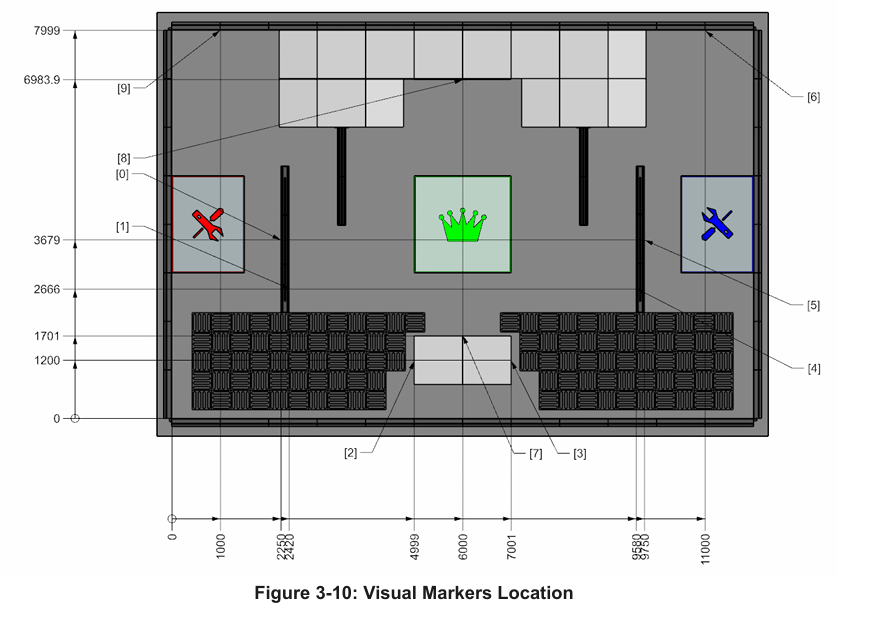

# Localization Package

This package publishes robot/camera localization estimates on the ROS 2 topic `localization/result`.
ALSO PLEASE NOTE: This readme is accurate, basically it works like any other node I'm just including what the result message payload looks like (so it can be parsed) and how to tune the parameters in the yaml file so localization actually localizes like it should lmao.

## What This Node Publishes

Node name: `localization_node`

Topic: `localization/result` (`std_msgs/msg/String`)

Message format (semicolon-delimited):

- `mode=<mode_label>`
- `detection=true|false`
- `markers=<count>` (present when detection is true)
- `rel_xyz_m=[x,y,z]`
- `abs_xy_m=[x,y]` (Literally this is the only one that matters. IDK why I included the other data but yeah this is the absolute position on the field in METERS in the x and y coordinates you define in the parameters)

Example payload:

`mode=camera_median; detection=true; markers=2; rel_xyz_m=[0.12,-0.03,1.84]; abs_xy_m=[2.55,1.32]`

If there are no detections/it can't find any of the visual markers to find its position on the field, it returns this payload:
`detection=false`

## Run The Node (Not really important unless you wanna test localization which is fair, also discord message me if (I'm Jason in software) you need help pls)

From workspace root:

```bash
colcon build --packages-select localization
source install/setup.bash
ros2 launch localization localization.launch.py
```

Use a custom parameter file:

```bash
ros2 launch localization localization.launch.py \
  params_file:=/absolute/path/to/localization_params.yaml
```

## How Subscriber Nodes Use It

Subscriber nodes do not need to know how `localization_node` is started. They only need:

1. The topic name: `localization/result`
2. The message type: `std_msgs/msg/String`
3. The payload schema documented above

Typical architecture (Pretty much the standard for all subscribing nodes):

1. A bringup launch file starts `localization_node` (and other nodes).
2. Consumer nodes subscribe to `localization/result`.
3. Consumer nodes parse the string and use `abs_xy_m`.

## Parameters (and What To Tweak)

Default parameter file: [config/localization_params.yaml](config/localization_params.yaml)

### Main knobs for behavior

- THIS IS VERY IMPORTANT: Everything with your tuning should be decided relative to the image directly below (the map of the field). I know we all don't have the same coordinate system, so this is where whoever uses this node can make the field position it returns be in the same coordnate system they use for the robot. 
- As you will find specified below, all you will need to modify when it comes to getting the right coordinate system is originMetersX, originMetersY, and superRotation, nothing else. 
    - The x and y values are the amount of METERS you want your origin (0,0) to be from the bottom left of the map on the image!!! So if your origin is the top right it is x=12, y=8, very simple. 
    - Then, superRotation is sort of self explanatory but it is what direction is positive x/y. The string/spelling matters, so just copy and paste from the valid options whatever you use for your coordinates. Pls note the superRotation does not depend on the origin above, so positive X is always right for specifying the origin stuff above and poisitive y is always up.
    - PLEASE DM me if you have any questions please!!!
\
\
\
Map to use:


- `processing_mode`: YOU REALLY WON'T HAVE TO CHANGE THIS ONE. JUST KEEP IS ON "camera_median"
  - Options: `image`, `camera`, `video`, `camera_median`, `video_median`
  - Use `camera_median` for smoother live output.
- `numFramesForMedian`: You can change this if you want, probably won't make much of a difference, but it's if the robot is too jerky, raise the value, if it's too slow to react, lower it.
  - Higher value: smoother but more lag.
  - Lower value: faster response but noisier.
- `originMetersX`, `originMetersY`:
  - Field origin translation offsets applied in final absolute coordinates.
- `superRotation`:
  - Coordinate-frame orientation mapping used by field transform.
  - Valid values:
    - `positiveXIsRight_positiveYIsUp`
    - `positiveXIsLeft_positiveYIsUp`
    - `positiveXIsRight_positiveYIsDown`
    - `positiveXIsLeft_positiveYIsDown`
    - `positiveXIsUp_positiveYIsRight`
    - `positiveXIsUp_positiveYIsLeft`
    - `positiveXIsDown_positiveYIsRight`
    - `positiveXIsDown_positiveYIsLeft`
- `timer_period_ms`: You might wanna change this but I think it's fine as is at 30 fps.
  - Callback period; lower values process more often and use more CPU.

### Input/output mode params (Likely won't need this so ignore it)

- `camera_index` for camera modes.
- `input_video_path` for video modes.
- `input_image_path` for image mode.
- `output_video_path` for annotated video output.

## Suggested Tuning Workflow

1. Start with `processing_mode=camera_median` and `numFramesForMedian=5`.
2. If output jitters, increase `numFramesForMedian`.
3. If output lags too much, decrease `numFramesForMedian`.
4. Align field frame using `originMetersX`, `originMetersY`, then `superRotation`.
5. Validate by moving known distances and comparing reported `abs_xy_m`.

## Bringup Pattern For Multi-Node Systems

Use one top-level bringup launch file that includes this package launch plus other node launches. Example call:

```bash
ros2 launch your_bringup_pkg bringup.launch.py
```

That top-level launch should include [launch/localization.launch.py](launch/localization.launch.py).

## Notes For Future Improvement

If subscribers become brittle due to string parsing, migrate `localization/result` to a custom message type so fields are strongly typed.
